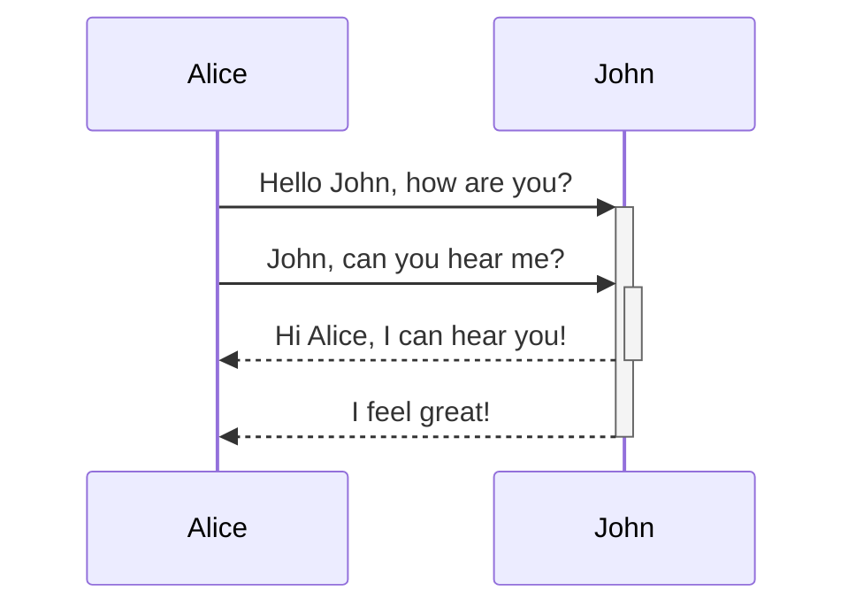
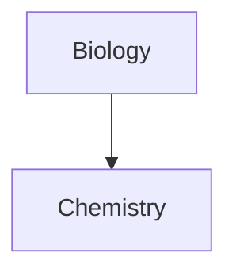
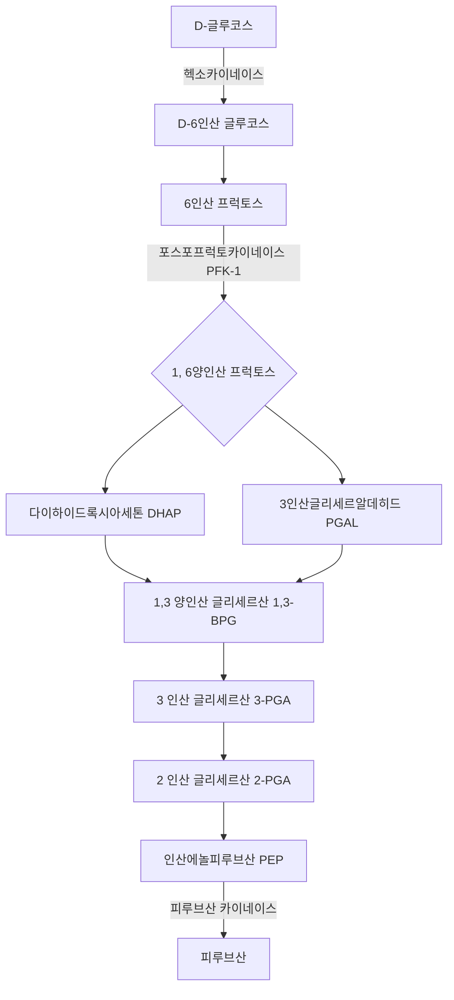

[[practice]]
[[practice#H1]]


# H1
_italic_
*italic*
**bold**
__bold__
- list 1
- list 2
	- list 2a (tab)
- list 3 (shift tab)
1. item 1
2. item 2
	1. item 2a
[Google](https://www.google.com) : https:// 붙여야됨 (다른 schema도 지원)

blockquote
> 피할 수 있으면 피할 수 없을 때까지 피해라

inline code (```` `something` ````)
`print('hello world!')`

code block (```` ``` block ``` ````)
```
for i in range(3):
    print('good')
```

- [ ] checklist

col1 | col2
--------|---------
item1 | item2
item3 | item4

취소선 : ~~deleted~~
하이라이트 : ==highlighted==
수직선
***
---
___

LaTeX support
$$\begin{vmatrix}a & b\\
c & d
\end{vmatrix}=ab-bc$$

%% comments : cannot see it in preview %%


Diagram - Mermaid




